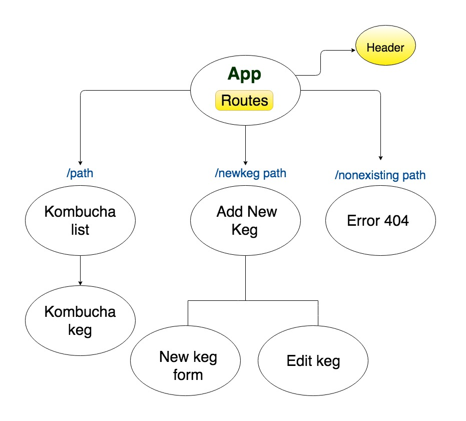

# Tap Room

_Published_  4/19/2019  
_Author_ **Gary Bermudez**

# Description:
I will be rebuilding the homepage of the Bose website [Bose Homepage](https://www.bose.com/en_us/index.html).
This is a project I built for school after finishing two weeks of learning ANGULAR to demonstrate understanding of the fundamental concepts. This ANGULAR application includes a working Firebase database and it has been deployed here [My ANGULAR Application](https://site-rebuild-80a1a.firebaseapp.com/).

Here is a list of components I created for this project:

* Header: top navigation menu
* KegList: This component acts like the homepage. It will display the list of all kegs.
* Keg: This component has the structure or model to represent a keg.
* NewKegForm: This component has a form so that the user can create a new keg with different properties.
* EditKeg: This component has a form that allows the user to edit an existing keg and change its properties.
* Error: This is a custom error message for the application.

This project was created using the React Library.

### Here is the app's component structure

# Setup/Installation Requirements

#### Prerequisites:
* npm package manager
* Node.js
* React

#### Cloning the Github repository (Mac OSX):
##### Important Note on  Firebase Credentials: If you decide to clone this repository, please make sure to acquire your own Firebase credentials and place them please them in a file `src/app/api-keys.ts`. See example below:

`export const masterFirebaseConfig = {
    apiKey: "xxxx",
    authDomain: "xxxx.firebaseapp.com",
    databaseURL: "https://xxxx.firebaseio.com",
    storageBucket: "xxxx.appspot.com",
    messagingSenderId: "xxxx"
  };`

* Open the Terminal in your computer
* Make sure you're in your Desktop directory
* Clone the repository `git clone`: https://github.com/garybm/tap-room
* In your Terminal, navigate to the project site-rebuild
* Run `npm install` in the terminal to install dependencies
* Run `npm run start` in your terminal: The npm run startcommand launches the server. The `start` option automatically opens your browser to http://localhost:8080/#/.

### Known Bugs

* Media queries have not been applied, the site is currently available only on Desktop view.

### Technologies Used
* React
* JSX
* CSS
* Firebase (to be implemented)

## Support and contact details

_Email garybm.17@gmail.com if you have any questions_

## License

This software is licensed under the MIT license.

Copyright (c) 2018 **Gary Bermudez**
